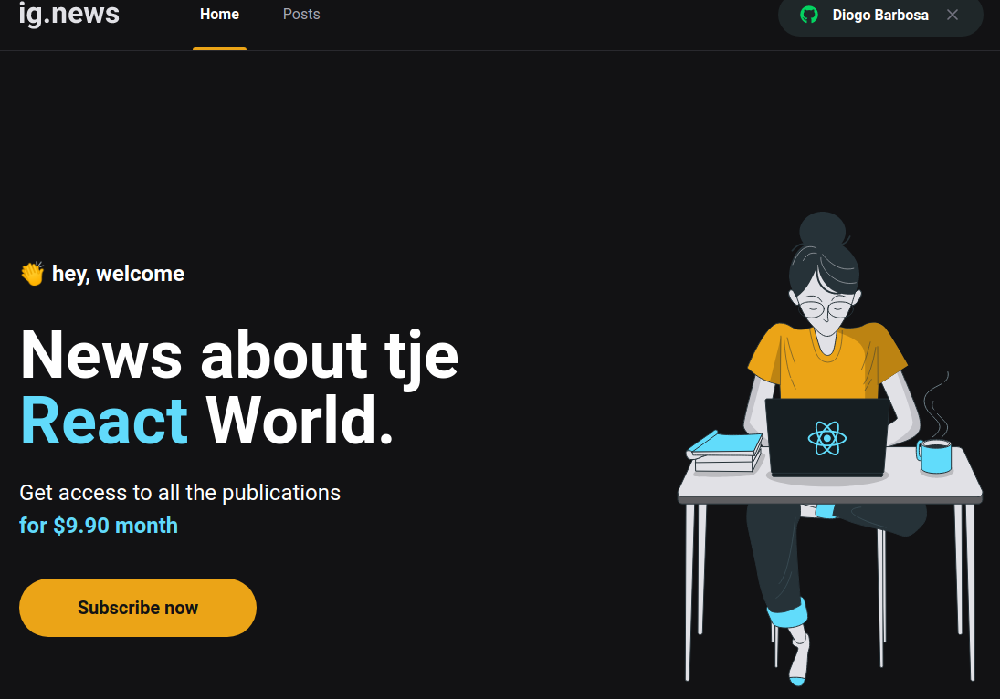
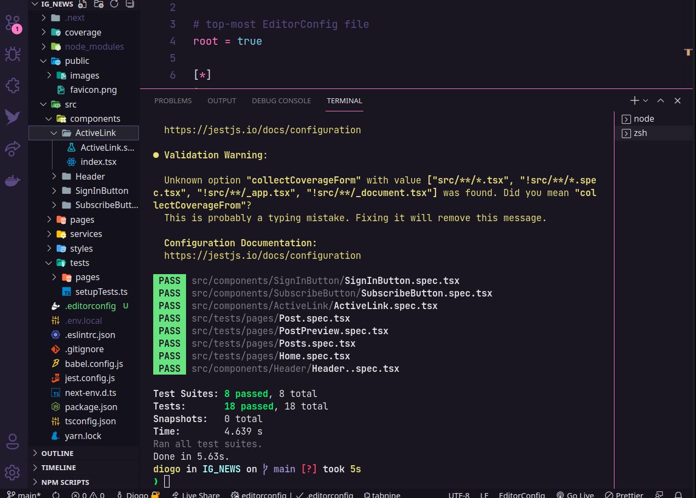

<div>
  <h1 align="center">IG_NEWS</h1>
  
  <div align="center">

  <a href="#sobre">Sobre</a> 
    |
  <a href="#tecnologias">Tecnólogias</a>
    |
  <a href="#dependências">Utilizar projeto</a>
    |
  <a href="#Projeto">Pagina do projeto</a>

  </div>
</div>

<div >
<div align="center">
  
  
  
  
</div>
</div>

<div>
  <h3>Sobre.</h3>
  <h4 id="sobre" > <b>Projeto feito em Next.js.</b>
   Desenvolvimento de aplicação para blog, com objetivo principal informar os usuários assinantes um melhor conteúdo voltado a tecnologia. O desenvolvimento envolve uma integração com o FAUNA.DB para autenticação de usuários e integração com o Stripe como meio de pagamento. A aplicação consta com integração com PRISMIC ( CMS ) para criação dos posts do blog. Testes foi utilizado o JEST para validação em componentes e funcionalidades.
  </h4>

  
  
  
</div>

<div id="tecnologias">
  <h3>Tecnológias.</h3>
  <ul>
    <li>
      <a href="https://nextjs.org/">NEXT.js.
      </a>
    </li>
    <li>
      <a href="https://pt-br.reactjs.org/docs/getting-started.html">REACT.Js
      </a>
    </li>
    <li>
      <a href="https://sass-lang.com/">
        SCSS.
      </a>
    </li>
    <li>
      <a href="https://www.typescriptlang.org/">
        TypeScript.
      </a>
    </li>
    <li>
      <a href="https://nodejs.org/pt-br/docs/">
        NODE.JS.
      </a>
    </li>
    <li>
      <a href="https://classic.yarnpkg.com/en/docs/">
        YARN.
      </a>
    </li>
     <li>
      <a href="https://prismic.io/">
        PRISMIC.
      </a>
    </li>
     </li>
     <li>
      <a href="https://fauna.com/">
        FAUNA.DB.
      </a>
    </li>
     </li>
     <li>
      <a href="https://stripe.com/br">
        STRIPE.
      </a>
    </li>
  </ul>
  
</div>

<div id="dependencias">

<h3>Baixar Projeto.</h3>  

```bash
# Clone this repository
$ git clone https://github.com/FullBarbosa/IG_NEWS.git IG_NEWS

# Install dependencies Yarn
$ yarn install

# Install dependencies NPM
$ npm install

# Install Stripe webHooks 
$ stripe login 

# Install Stripe webHooks returno http 
$ stripe listen --forward-to localhost:caminho_base_rota_api
```
 </div>